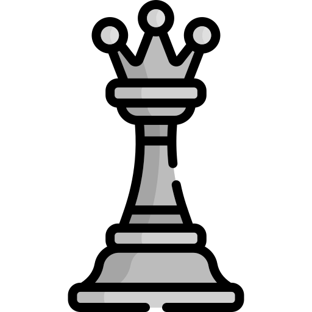

# Hi there 👋 I'm Billy

## How About Some Chess ♟

---

This game was made by the amazing [marcizhu](https://github.com/marcizhu), have a look [here](https://github.com/marcizhu/readme-chess).

It's your turn to play! Move a <!-- BEGIN TURN -->white<!-- END TURN --> piece.

<!-- BEGIN CHESS BOARD -->
|   | A | B | C | D | E | F | G | H |   |
|---|:-:|:-:|:-:|:-:|:-:|:-:|:-:|:-:|:-:|
| **8** |  |  |  |  |  |  |  |  | **8** |
| **7** |  |  |  |  |  |  |  |  | **7** |
| **6** |  |  |  |  |  |  |  |  | **6** |
| **5** |  |  |  |  |  |  |  |  | **5** |
| **4** |  |  |  |  |  |  |  |  | **4** |
| **3** |  |  |  |  |  |  |  |  | **3** |
| **2** |  |  |  |  |  |  |  |  | **2** |
| **1** |  |  |  |  |  |  |  |  | **1** |
|   | **A** | **B** | **C** | **D** | **E** | **F** | **G** | **H** |   |
<!-- END CHESS BOARD -->

**Choose one move from the following table**
<!-- BEGIN MOVES LIST -->
|  FROM  | TO (Just click a link!) |
| :----: | :---------------------- |
| **A1** | [A2](https://github.com/billyateallcookies/billyateallcookies/issues/new?title=Chess%3A+Move+A1+to+A2&body=Please+do+not+change+the+title.+Just+click+%22Submit+new+issue%22.+You+don%27t+need+to+do+anything+else+%3AD), [A3](https://github.com/billyateallcookies/billyateallcookies/issues/new?title=Chess%3A+Move+A1+to+A3&body=Please+do+not+change+the+title.+Just+click+%22Submit+new+issue%22.+You+don%27t+need+to+do+anything+else+%3AD), [B1](https://github.com/billyateallcookies/billyateallcookies/issues/new?title=Chess%3A+Move+A1+to+B1&body=Please+do+not+change+the+title.+Just+click+%22Submit+new+issue%22.+You+don%27t+need+to+do+anything+else+%3AD), [C1](https://github.com/billyateallcookies/billyateallcookies/issues/new?title=Chess%3A+Move+A1+to+C1&body=Please+do+not+change+the+title.+Just+click+%22Submit+new+issue%22.+You+don%27t+need+to+do+anything+else+%3AD) |
| **A4** | [B5](https://github.com/billyateallcookies/billyateallcookies/issues/new?title=Chess%3A+Move+A4+to+B5&body=Please+do+not+change+the+title.+Just+click+%22Submit+new+issue%22.+You+don%27t+need+to+do+anything+else+%3AD) |
| **B2** | [B3](https://github.com/billyateallcookies/billyateallcookies/issues/new?title=Chess%3A+Move+B2+to+B3&body=Please+do+not+change+the+title.+Just+click+%22Submit+new+issue%22.+You+don%27t+need+to+do+anything+else+%3AD), [B4](https://github.com/billyateallcookies/billyateallcookies/issues/new?title=Chess%3A+Move+B2+to+B4&body=Please+do+not+change+the+title.+Just+click+%22Submit+new+issue%22.+You+don%27t+need+to+do+anything+else+%3AD) |
| **C3** | [A2](https://github.com/billyateallcookies/billyateallcookies/issues/new?title=Chess%3A+Move+C3+to+A2&body=Please+do+not+change+the+title.+Just+click+%22Submit+new+issue%22.+You+don%27t+need+to+do+anything+else+%3AD), [B1](https://github.com/billyateallcookies/billyateallcookies/issues/new?title=Chess%3A+Move+C3+to+B1&body=Please+do+not+change+the+title.+Just+click+%22Submit+new+issue%22.+You+don%27t+need+to+do+anything+else+%3AD), [B5](https://github.com/billyateallcookies/billyateallcookies/issues/new?title=Chess%3A+Move+C3+to+B5&body=Please+do+not+change+the+title.+Just+click+%22Submit+new+issue%22.+You+don%27t+need+to+do+anything+else+%3AD), [D5](https://github.com/billyateallcookies/billyateallcookies/issues/new?title=Chess%3A+Move+C3+to+D5&body=Please+do+not+change+the+title.+Just+click+%22Submit+new+issue%22.+You+don%27t+need+to+do+anything+else+%3AD), [E2](https://github.com/billyateallcookies/billyateallcookies/issues/new?title=Chess%3A+Move+C3+to+E2&body=Please+do+not+change+the+title.+Just+click+%22Submit+new+issue%22.+You+don%27t+need+to+do+anything+else+%3AD), [E4](https://github.com/billyateallcookies/billyateallcookies/issues/new?title=Chess%3A+Move+C3+to+E4&body=Please+do+not+change+the+title.+Just+click+%22Submit+new+issue%22.+You+don%27t+need+to+do+anything+else+%3AD) |
| **D1** | [B1](https://github.com/billyateallcookies/billyateallcookies/issues/new?title=Chess%3A+Move+D1+to+B1&body=Please+do+not+change+the+title.+Just+click+%22Submit+new+issue%22.+You+don%27t+need+to+do+anything+else+%3AD), [C1](https://github.com/billyateallcookies/billyateallcookies/issues/new?title=Chess%3A+Move+D1+to+C1&body=Please+do+not+change+the+title.+Just+click+%22Submit+new+issue%22.+You+don%27t+need+to+do+anything+else+%3AD), [D2](https://github.com/billyateallcookies/billyateallcookies/issues/new?title=Chess%3A+Move+D1+to+D2&body=Please+do+not+change+the+title.+Just+click+%22Submit+new+issue%22.+You+don%27t+need+to+do+anything+else+%3AD), [D3](https://github.com/billyateallcookies/billyateallcookies/issues/new?title=Chess%3A+Move+D1+to+D3&body=Please+do+not+change+the+title.+Just+click+%22Submit+new+issue%22.+You+don%27t+need+to+do+anything+else+%3AD), [E2](https://github.com/billyateallcookies/billyateallcookies/issues/new?title=Chess%3A+Move+D1+to+E2&body=Please+do+not+change+the+title.+Just+click+%22Submit+new+issue%22.+You+don%27t+need+to+do+anything+else+%3AD), [F3](https://github.com/billyateallcookies/billyateallcookies/issues/new?title=Chess%3A+Move+D1+to+F3&body=Please+do+not+change+the+title.+Just+click+%22Submit+new+issue%22.+You+don%27t+need+to+do+anything+else+%3AD), [G4](https://github.com/billyateallcookies/billyateallcookies/issues/new?title=Chess%3A+Move+D1+to+G4&body=Please+do+not+change+the+title.+Just+click+%22Submit+new+issue%22.+You+don%27t+need+to+do+anything+else+%3AD), [H5](https://github.com/billyateallcookies/billyateallcookies/issues/new?title=Chess%3A+Move+D1+to+H5&body=Please+do+not+change+the+title.+Just+click+%22Submit+new+issue%22.+You+don%27t+need+to+do+anything+else+%3AD) |
| **D4** | [D5](https://github.com/billyateallcookies/billyateallcookies/issues/new?title=Chess%3A+Move+D4+to+D5&body=Please+do+not+change+the+title.+Just+click+%22Submit+new+issue%22.+You+don%27t+need+to+do+anything+else+%3AD) |
| **E1** | [D2](https://github.com/billyateallcookies/billyateallcookies/issues/new?title=Chess%3A+Move+E1+to+D2&body=Please+do+not+change+the+title.+Just+click+%22Submit+new+issue%22.+You+don%27t+need+to+do+anything+else+%3AD), [E2](https://github.com/billyateallcookies/billyateallcookies/issues/new?title=Chess%3A+Move+E1+to+E2&body=Please+do+not+change+the+title.+Just+click+%22Submit+new+issue%22.+You+don%27t+need+to+do+anything+else+%3AD) |
| **F1** | [B5](https://github.com/billyateallcookies/billyateallcookies/issues/new?title=Chess%3A+Move+F1+to+B5&body=Please+do+not+change+the+title.+Just+click+%22Submit+new+issue%22.+You+don%27t+need+to+do+anything+else+%3AD), [C4](https://github.com/billyateallcookies/billyateallcookies/issues/new?title=Chess%3A+Move+F1+to+C4&body=Please+do+not+change+the+title.+Just+click+%22Submit+new+issue%22.+You+don%27t+need+to+do+anything+else+%3AD), [D3](https://github.com/billyateallcookies/billyateallcookies/issues/new?title=Chess%3A+Move+F1+to+D3&body=Please+do+not+change+the+title.+Just+click+%22Submit+new+issue%22.+You+don%27t+need+to+do+anything+else+%3AD), [E2](https://github.com/billyateallcookies/billyateallcookies/issues/new?title=Chess%3A+Move+F1+to+E2&body=Please+do+not+change+the+title.+Just+click+%22Submit+new+issue%22.+You+don%27t+need+to+do+anything+else+%3AD) |
| **F2** | [F3](https://github.com/billyateallcookies/billyateallcookies/issues/new?title=Chess%3A+Move+F2+to+F3&body=Please+do+not+change+the+title.+Just+click+%22Submit+new+issue%22.+You+don%27t+need+to+do+anything+else+%3AD) |
| **F4** | [B8](https://github.com/billyateallcookies/billyateallcookies/issues/new?title=Chess%3A+Move+F4+to+B8&body=Please+do+not+change+the+title.+Just+click+%22Submit+new+issue%22.+You+don%27t+need+to+do+anything+else+%3AD), [C1](https://github.com/billyateallcookies/billyateallcookies/issues/new?title=Chess%3A+Move+F4+to+C1&body=Please+do+not+change+the+title.+Just+click+%22Submit+new+issue%22.+You+don%27t+need+to+do+anything+else+%3AD), [C7](https://github.com/billyateallcookies/billyateallcookies/issues/new?title=Chess%3A+Move+F4+to+C7&body=Please+do+not+change+the+title.+Just+click+%22Submit+new+issue%22.+You+don%27t+need+to+do+anything+else+%3AD), [D2](https://github.com/billyateallcookies/billyateallcookies/issues/new?title=Chess%3A+Move+F4+to+D2&body=Please+do+not+change+the+title.+Just+click+%22Submit+new+issue%22.+You+don%27t+need+to+do+anything+else+%3AD), [D6](https://github.com/billyateallcookies/billyateallcookies/issues/new?title=Chess%3A+Move+F4+to+D6&body=Please+do+not+change+the+title.+Just+click+%22Submit+new+issue%22.+You+don%27t+need+to+do+anything+else+%3AD), [E3](https://github.com/billyateallcookies/billyateallcookies/issues/new?title=Chess%3A+Move+F4+to+E3&body=Please+do+not+change+the+title.+Just+click+%22Submit+new+issue%22.+You+don%27t+need+to+do+anything+else+%3AD), [E5](https://github.com/billyateallcookies/billyateallcookies/issues/new?title=Chess%3A+Move+F4+to+E5&body=Please+do+not+change+the+title.+Just+click+%22Submit+new+issue%22.+You+don%27t+need+to+do+anything+else+%3AD), [G3](https://github.com/billyateallcookies/billyateallcookies/issues/new?title=Chess%3A+Move+F4+to+G3&body=Please+do+not+change+the+title.+Just+click+%22Submit+new+issue%22.+You+don%27t+need+to+do+anything+else+%3AD), [G5](https://github.com/billyateallcookies/billyateallcookies/issues/new?title=Chess%3A+Move+F4+to+G5&body=Please+do+not+change+the+title.+Just+click+%22Submit+new+issue%22.+You+don%27t+need+to+do+anything+else+%3AD), [H6](https://github.com/billyateallcookies/billyateallcookies/issues/new?title=Chess%3A+Move+F4+to+H6&body=Please+do+not+change+the+title.+Just+click+%22Submit+new+issue%22.+You+don%27t+need+to+do+anything+else+%3AD) |
| **G1** | [E2](https://github.com/billyateallcookies/billyateallcookies/issues/new?title=Chess%3A+Move+G1+to+E2&body=Please+do+not+change+the+title.+Just+click+%22Submit+new+issue%22.+You+don%27t+need+to+do+anything+else+%3AD), [F3](https://github.com/billyateallcookies/billyateallcookies/issues/new?title=Chess%3A+Move+G1+to+F3&body=Please+do+not+change+the+title.+Just+click+%22Submit+new+issue%22.+You+don%27t+need+to+do+anything+else+%3AD), [H3](https://github.com/billyateallcookies/billyateallcookies/issues/new?title=Chess%3A+Move+G1+to+H3&body=Please+do+not+change+the+title.+Just+click+%22Submit+new+issue%22.+You+don%27t+need+to+do+anything+else+%3AD) |
| **G2** | [G3](https://github.com/billyateallcookies/billyateallcookies/issues/new?title=Chess%3A+Move+G2+to+G3&body=Please+do+not+change+the+title.+Just+click+%22Submit+new+issue%22.+You+don%27t+need+to+do+anything+else+%3AD), [G4](https://github.com/billyateallcookies/billyateallcookies/issues/new?title=Chess%3A+Move+G2+to+G4&body=Please+do+not+change+the+title.+Just+click+%22Submit+new+issue%22.+You+don%27t+need+to+do+anything+else+%3AD) |
| **H2** | [H3](https://github.com/billyateallcookies/billyateallcookies/issues/new?title=Chess%3A+Move+H2+to+H3&body=Please+do+not+change+the+title.+Just+click+%22Submit+new+issue%22.+You+don%27t+need+to+do+anything+else+%3AD), [H4](https://github.com/billyateallcookies/billyateallcookies/issues/new?title=Chess%3A+Move+H2+to+H4&body=Please+do+not+change+the+title.+Just+click+%22Submit+new+issue%22.+You+don%27t+need+to+do+anything+else+%3AD) |
<!-- END MOVES LIST -->

Having fun? Ask a friend to do the next move!

  
Last 5 moves in this game

<!-- BEGIN LAST MOVES -->

| Move | Author |
| :--: | :----- |
| `C7` to `C6` | [ @YeffyCodeGit](https://github.com/YeffyCodeGit) |
| `C1` to `F4` | [ @Asianerd](https://github.com/Asianerd) |
| `F7` to `F5` | [ @billyeatcookies](https://github.com/billyeatcookies) |
| `B1` to `C3` | [ @me-coder-1204](https://github.com/me-coder-1204) |
| `A7` to `A5` | [ @billyeatcookies](https://github.com/billyeatcookies) |

<!-- END LAST MOVES -->

  
Top 10 most moves across all games

<!-- BEGIN TOP MOVES -->

| Total moves |  User  |
| :---------: | :----- |
| 3 | [@Asianerd](https://github.com/Asianerd) |
| 3 | [@billyeatcookies](https://github.com/billyeatcookies) |
| 2 | [@me-coder-1204](https://github.com/me-coder-1204) |
| 1 | [@billyateallcookies](https://github.com/billyateallcookies) |
| 1 | [@Sidohh](https://github.com/Sidohh) |
| 1 | [@LouisTheXIV](https://github.com/LouisTheXIV) |
| 1 | [@YeffyCodeGit](https://github.com/YeffyCodeGit) |

<!-- END TOP MOVES -->

