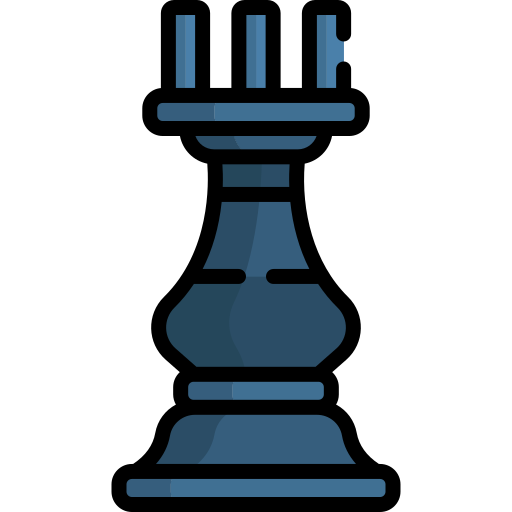
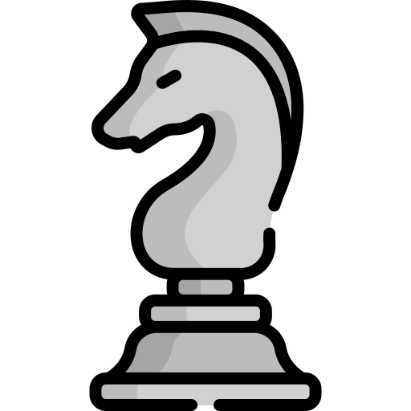

# Hi there 👋 I'm Billy

## How About Some Chess ♟

---

This game was made by the amazing [marcizhu](https://github.com/marcizhu), have a look [here](https://github.com/marcizhu/readme-chess).

It's your turn to play! Move a <!-- BEGIN TURN -->black<!-- END TURN --> piece.

<!-- BEGIN CHESS BOARD -->
|   | A | B | C | D | E | F | G | H |   |
|---|:-:|:-:|:-:|:-:|:-:|:-:|:-:|:-:|:-:|
| **8** |  |  |  |  |  |  |  |  | **8** |
| **7** |  |  |  |  |  |  |  |  | **7** |
| **6** |  |  |  |  |  |  |  |  | **6** |
| **5** |  |  |  |  |  |  |  |  | **5** |
| **4** |  |  |  |  |  |  |  |  | **4** |
| **3** |  |  |  |  |  |  |  |  | **3** |
| **2** |  |  |  |  |  |  |  |  | **2** |
| **1** |  |  |  |  |  |  |  |  | **1** |
|   | **A** | **B** | **C** | **D** | **E** | **F** | **G** | **H** |   |
<!-- END CHESS BOARD -->

**Choose one move from the following table**
<!-- BEGIN MOVES LIST -->
|  FROM  | TO (Just click a link!) |
| :----: | :---------------------- |
| **A7** | [A5](https://github.com/billyateallcookies/billyateallcookies/issues/new?title=Chess%3A+Move+A7+to+A5&body=Please+do+not+change+the+title.+Just+click+%22Submit+new+issue%22.+You+don%27t+need+to+do+anything+else+%3AD), [A6](https://github.com/billyateallcookies/billyateallcookies/issues/new?title=Chess%3A+Move+A7+to+A6&body=Please+do+not+change+the+title.+Just+click+%22Submit+new+issue%22.+You+don%27t+need+to+do+anything+else+%3AD) |
| **B7** | [B5](https://github.com/billyateallcookies/billyateallcookies/issues/new?title=Chess%3A+Move+B7+to+B5&body=Please+do+not+change+the+title.+Just+click+%22Submit+new+issue%22.+You+don%27t+need+to+do+anything+else+%3AD), [B6](https://github.com/billyateallcookies/billyateallcookies/issues/new?title=Chess%3A+Move+B7+to+B6&body=Please+do+not+change+the+title.+Just+click+%22Submit+new+issue%22.+You+don%27t+need+to+do+anything+else+%3AD) |
| **B8** | [A6](https://github.com/billyateallcookies/billyateallcookies/issues/new?title=Chess%3A+Move+B8+to+A6&body=Please+do+not+change+the+title.+Just+click+%22Submit+new+issue%22.+You+don%27t+need+to+do+anything+else+%3AD), [C6](https://github.com/billyateallcookies/billyateallcookies/issues/new?title=Chess%3A+Move+B8+to+C6&body=Please+do+not+change+the+title.+Just+click+%22Submit+new+issue%22.+You+don%27t+need+to+do+anything+else+%3AD) |
| **C7** | [C5](https://github.com/billyateallcookies/billyateallcookies/issues/new?title=Chess%3A+Move+C7+to+C5&body=Please+do+not+change+the+title.+Just+click+%22Submit+new+issue%22.+You+don%27t+need+to+do+anything+else+%3AD), [C6](https://github.com/billyateallcookies/billyateallcookies/issues/new?title=Chess%3A+Move+C7+to+C6&body=Please+do+not+change+the+title.+Just+click+%22Submit+new+issue%22.+You+don%27t+need+to+do+anything+else+%3AD) |
| **D7** | [D5](https://github.com/billyateallcookies/billyateallcookies/issues/new?title=Chess%3A+Move+D7+to+D5&body=Please+do+not+change+the+title.+Just+click+%22Submit+new+issue%22.+You+don%27t+need+to+do+anything+else+%3AD), [D6](https://github.com/billyateallcookies/billyateallcookies/issues/new?title=Chess%3A+Move+D7+to+D6&body=Please+do+not+change+the+title.+Just+click+%22Submit+new+issue%22.+You+don%27t+need+to+do+anything+else+%3AD) |
| **E7** | [E5](https://github.com/billyateallcookies/billyateallcookies/issues/new?title=Chess%3A+Move+E7+to+E5&body=Please+do+not+change+the+title.+Just+click+%22Submit+new+issue%22.+You+don%27t+need+to+do+anything+else+%3AD), [E6](https://github.com/billyateallcookies/billyateallcookies/issues/new?title=Chess%3A+Move+E7+to+E6&body=Please+do+not+change+the+title.+Just+click+%22Submit+new+issue%22.+You+don%27t+need+to+do+anything+else+%3AD) |
| **F7** | [F5](https://github.com/billyateallcookies/billyateallcookies/issues/new?title=Chess%3A+Move+F7+to+F5&body=Please+do+not+change+the+title.+Just+click+%22Submit+new+issue%22.+You+don%27t+need+to+do+anything+else+%3AD), [F6](https://github.com/billyateallcookies/billyateallcookies/issues/new?title=Chess%3A+Move+F7+to+F6&body=Please+do+not+change+the+title.+Just+click+%22Submit+new+issue%22.+You+don%27t+need+to+do+anything+else+%3AD) |
| **G7** | [G5](https://github.com/billyateallcookies/billyateallcookies/issues/new?title=Chess%3A+Move+G7+to+G5&body=Please+do+not+change+the+title.+Just+click+%22Submit+new+issue%22.+You+don%27t+need+to+do+anything+else+%3AD), [G6](https://github.com/billyateallcookies/billyateallcookies/issues/new?title=Chess%3A+Move+G7+to+G6&body=Please+do+not+change+the+title.+Just+click+%22Submit+new+issue%22.+You+don%27t+need+to+do+anything+else+%3AD) |
| **G8** | [F6](https://github.com/billyateallcookies/billyateallcookies/issues/new?title=Chess%3A+Move+G8+to+F6&body=Please+do+not+change+the+title.+Just+click+%22Submit+new+issue%22.+You+don%27t+need+to+do+anything+else+%3AD), [H6](https://github.com/billyateallcookies/billyateallcookies/issues/new?title=Chess%3A+Move+G8+to+H6&body=Please+do+not+change+the+title.+Just+click+%22Submit+new+issue%22.+You+don%27t+need+to+do+anything+else+%3AD) |
| **H7** | [H5](https://github.com/billyateallcookies/billyateallcookies/issues/new?title=Chess%3A+Move+H7+to+H5&body=Please+do+not+change+the+title.+Just+click+%22Submit+new+issue%22.+You+don%27t+need+to+do+anything+else+%3AD), [H6](https://github.com/billyateallcookies/billyateallcookies/issues/new?title=Chess%3A+Move+H7+to+H6&body=Please+do+not+change+the+title.+Just+click+%22Submit+new+issue%22.+You+don%27t+need+to+do+anything+else+%3AD) |
<!-- END MOVES LIST -->

Having fun? Ask a friend to do the next move!

  
Last 5 moves in this game

<!-- BEGIN LAST MOVES -->

| Move | Author |
| :--: | :----- |
| `A2` to `A3` | [ @billyateallcookies](https://github.com/billyateallcookies) |
| `Start game` | [ @billyateallcookies](https://github.com/billyateallcookies) |

<!-- END LAST MOVES -->

  
Top 10 most moves across all games

<!-- BEGIN TOP MOVES -->

| Total moves |  User  |
| :---------: | :----- |
| 1 | [@billyateallcookies](https://github.com/billyateallcookies) |

<!-- END TOP MOVES -->

